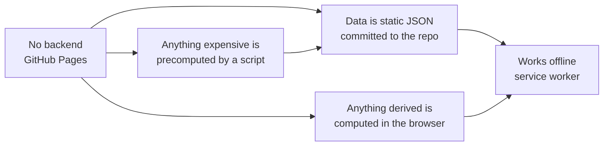
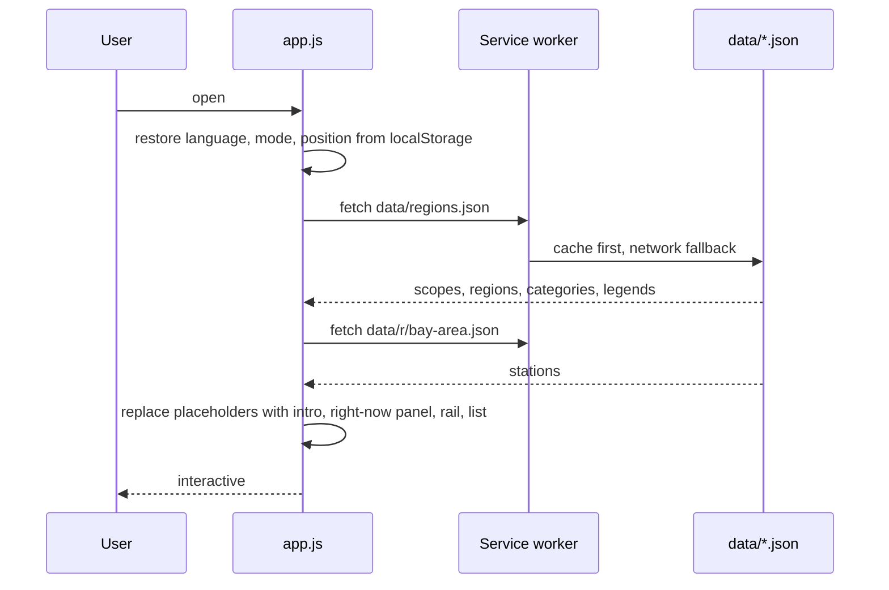
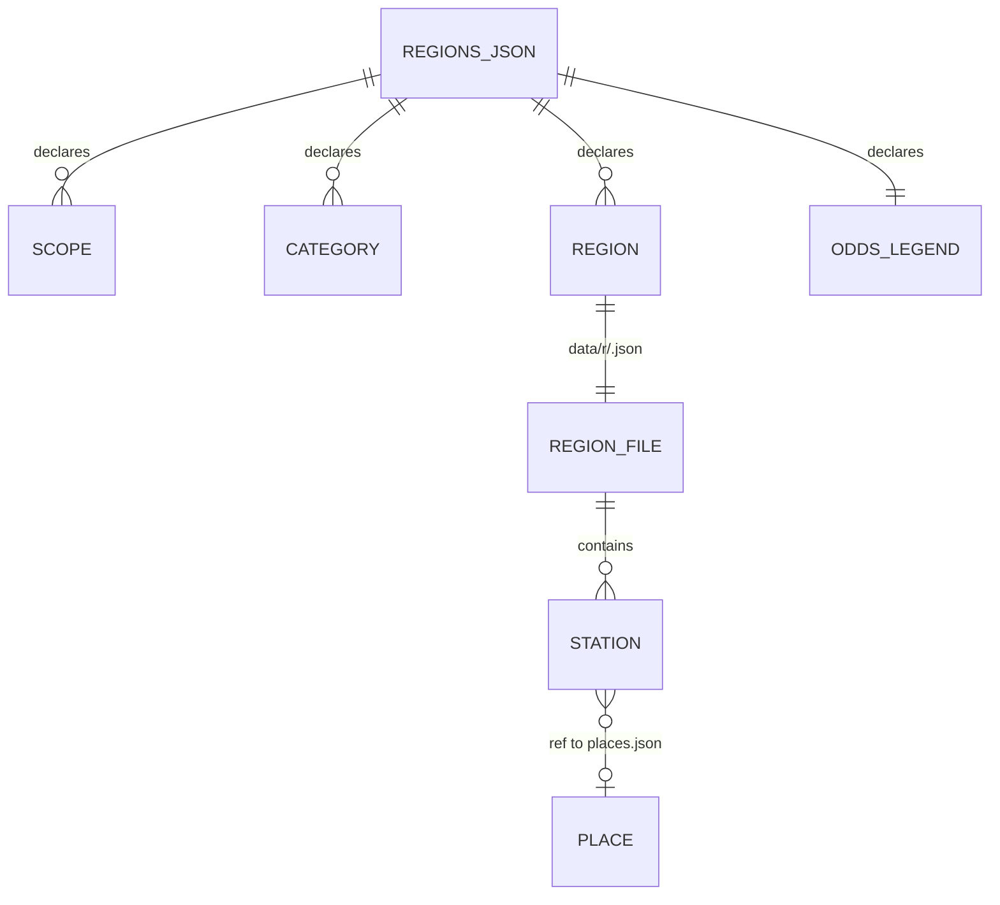
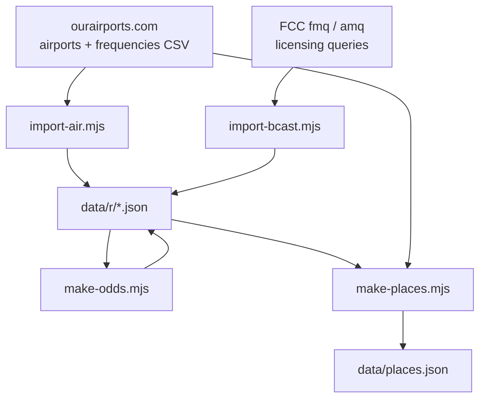
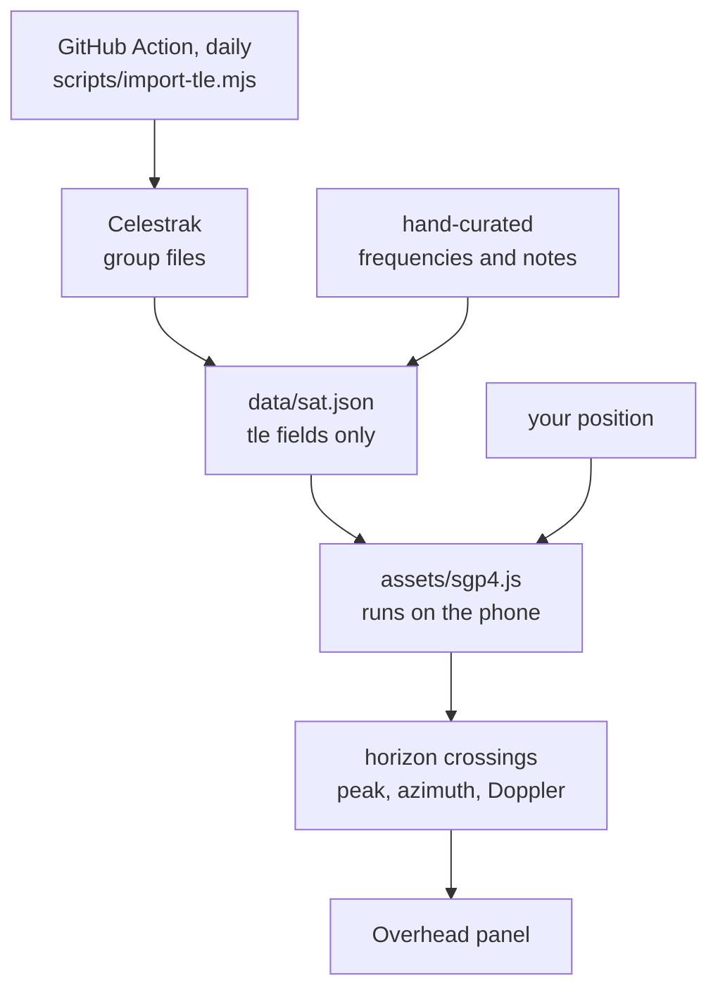
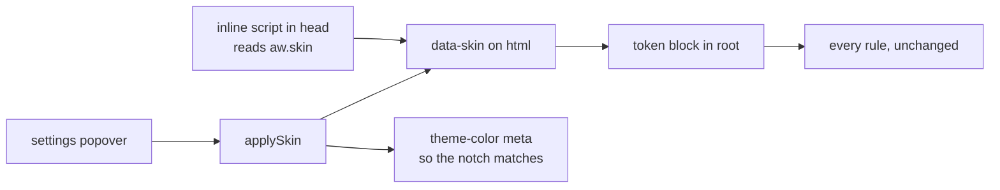
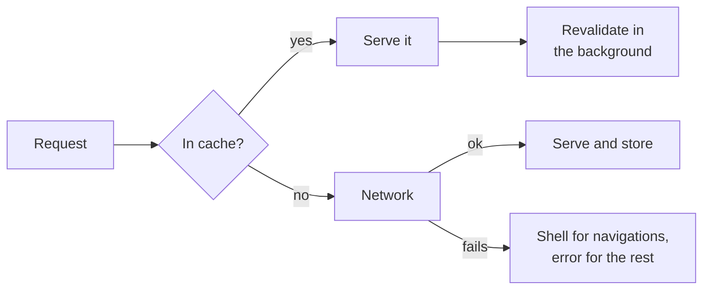

# Architecture

This describes the shape of the project rather than its details. Anything written here should
still be true after a redesign of the interface or a rewrite of the rendering; the specifics
of any one function belong in the code, where they cannot drift out of date.

## The one constraint that explains everything

The site is hosted on GitHub Pages. There is **no backend, no build step, and no database**.
Every decision below follows from that.

If a feature needs a server, it cannot exist. If it needs a lookup table, the table is
generated ahead of time by a script and committed. If it needs arithmetic — distances,
sunrise, antenna lengths, wavelengths, repeater inputs — the browser does it, which means it
keeps working in airplane mode.

## Runtime layout

Five files do the work. There is no framework, no bundler and no runtime dependency.

| File | Responsibility |
| --- | --- |
| `index.html` | The shell: header, search, region strip, and the placeholders the app replaces. |
| `assets/app.js` | All behaviour, in one IIFE. Routing, rendering, state, i18n, audio, live data. |
| `assets/styles.css` | All styling, hand written, with the design tokens at the top. |
| `sw.js` | Cache-first service worker. `V` is the cache version and must be bumped on release. |
| `data/*.json` | The content. See [Data model](#data-model). |

### How a page gets drawn

### Why the placeholders are markup

The skeleton lives in `index.html`, not in `app.js`, and this is load bearing. People use
this outdoors, one handed, and a page that jumps as you reach for it is worse than a slow
one — so the first paint has to be the final shape.

A script cannot guarantee that. First paint happens when the browser draws the parsed HTML,
which on a cold load is *before* `app.js` executes; injected placeholders arrive after it and
the page drops by the height of everything above the list. On a fast warm load the script
wins the race and the bug hides, which is exactly why it survived: it only appeared on the
first visit, on desktop, and never on the phone the site was tested on.

Two consequences follow:

- **`index.html` owns the placeholder markup.** `app.js` leaves the first set alone and only
  builds skeletons for later region switches.
- **A small inline script in `<head>` settles mode and country before anything is drawn**,
  because those decide the shape — pro mode has the right-now panel, and China has one fewer
  live reading. CSS sizes the placeholders off the resulting attributes. This repeats a few
  lines that `app.js` owns, so a test asserts the two agree.

What cannot be reserved honestly is anything whose height depends on data not yet fetched.
The intro is prose from the region file and runs from 208 to 493 pixels across the regions
and both languages, so the placeholder holds the median for its width: the typical region
does not move at all and the outliers move about half as far. A per-region note is left
unreserved entirely, because holding space for it would leave a permanent gap on the regions
that do not carry one.

Measure this over a throttled connection. On localhost the data arrives before the first
paint, every shift is attributed to the initial render and the number reads zero no matter
what the placeholders do — the phone pages that measured 0 locally measured 0.15 over the
real network.

## Data model

`data/regions.json` is the index: which countries exist, which regions belong to them, the
category list, and the legends for odds and confidence. Each region has its own file under
`data/r/`, holding an intro and a flat array of stations. `data/places.json` is a generated
lookup from ICAO code to coordinates, so an entry can say where its transmitter is without
carrying a copy of the airport database.

A station is deliberately flat — no nesting, no references except `ref`. It is edited by hand
far more often than it is read by a program, and a shape you can scan in a text editor is
worth more than a normalised one.

### Provenance

Entries come from three places, and an entry knows which.

| `src` | Origin | Written by |
| --- | --- | --- |
| absent | Hand written, usually with prose | A person |
| `oa` | ourairports airport frequency database | `scripts/import-air.mjs` |
| `fcc` | FCC FM and AM licensing queries | `scripts/import-bcast.mjs` |

This field is what makes the importers safe to re-run. Each one strips the lines carrying its
own marker before regenerating, so it is idempotent and a rule change replaces its output
instead of stacking a second copy on top. It also means a hand-written entry can never be
destroyed by a generator, which is the failure that would matter.

## Build-time scripts

The order matters: importers first, then `make-odds.mjs` to score whatever is now there, then
`make-places.mjs` if any new `ref` appeared. All of them write into the repo and none of them
run in the browser.

Every generator holds to the same three rules, learned the hard way:

1. **Edit lines, do not re-serialise.** The data files are hand formatted. Round-tripping them
   through `JSON.stringify` loses the trailing zeros on frequencies and the blank lines that
   group categories, and turns a one-field change into an unreviewable diff.
2. **Refuse to write something broken.** After splicing text into JSON, parse it back and check
   the station count is what was intended. Fail loudly rather than commit a corrupt file.
3. **Be idempotent.** Find and replace your own previous output.

## Curation, and why the importers are deliberately small

Upstream has 30,000 airport frequencies and 9,000 licensed US broadcast stations. Importing
freely would bury the site: aviation alone reaches 56% of all entries at a natural setting.
So each importer is capped, and the caps are the feature.

| Rule | Why |
| --- | --- |
| A transmitter belongs to the region it is **nearest** | Ranking by significance inside a radius gave the Central Coast San Jose and San Francisco, 130 and 170 km away and already covered where they belong, while Monterey lost its slot |
| A handful of sites per region, a handful of positions per site | What you want from an unfamiliar airport is the weather loop, the tower, the ground. Not all eleven positions |
| One frequency per position per site | Beijing Capital publishes three tower frequencies by runway; that produced three identical rows |
| Broadcast quotas split public / commercial / AM | Sorting purely by power yields twelve commercial giants and no news, college or community radio |
| Never shadow an existing entry | Matched on frequency, on callsign, and on the site-and-position pair, so prose and local knowledge always win |
| Standard numbers listed once | 121.900 is ground control at half the fields in a metro area; repeating it stacks ticks on one spot of the spectrum rail |

## Odds

The one derived quantity in the data, and the only one with an opinion in it. It answers
"if I tune here, will I hear anything?" by folding three inputs into three levels.

```mermaid
graph TD
  S[Station] --> Dig{"Decodable?"}
  Dig -->|"digital or encrypted"| N["no value<br/>a bar would be a lie"]
  Dig -->|yes| C{"Continuous carrier?<br/>weather radio, ATIS,<br/>a licensed broadcaster"}
  C -->|yes| P{"Wide coverage?"}
  P -->|yes| T3["3 — always on"]
  P -->|"sub-kilowatt"| T2
  C -->|no| B{"Worked position?<br/>tower, port, VTS,<br/>maintained repeater"}
  B -->|yes| T2["2 — usually something"]
  B -->|no| T1["1 — long shot"]
  V["Given as a range<br/>to sweep"] --> T1
```

Two properties are worth preserving through any rewrite. First, confidence is an *input* to
the odds rather than a second badge beside them, because a frequency nobody is sure of cannot
honestly be a sure thing. Second, the rules live in one script, not in the data, so they can
be explained, argued with and re-run; `oddsFix` exists for the cases where a rule is wrong
about one entry, and using it should stay rare enough to be noticeable.

## Modes

Simple and Pro are not a feature flag. They answer different questions, and a control belongs
to whichever question it serves.

| | Simple | Pro |
| --- | --- | --- |
| Tapping a row | Copies the frequency | Opens the detail panel; copy moves inside it |
| Under each entry | Nothing | Distance, bearing, amateur band — only when there is something to say |
| Odds indicator | Bars | Bars and the word |
| Spectrum rail | Tap to jump | A tuning knob: continuous sweep, detents, hiss, clicks |
| Above the list | Intro | Intro and the right-now panel |
| Network | None | Three live readings, each cached, each optional |

Pro is chosen deliberately: it is remembered, and `?pro=1` or `?pro=0` forces it so a view can
be shared. Simple remains the design centre — outdoors, one hand, bright sun, no signal.

## Satellites

The constraint that shapes this feature is the same one as everywhere else: there is no
server. Pass predictions cannot be computed anywhere but on the phone, which rules out
calling a prediction API and means carrying an orbit propagator in the page.

### What is automated and what is not

The split is not arbitrary. Orbital elements are a fit to a short arc of tracking data: good
to about a kilometre for a day or two, and by a week out wrong enough to move a predicted pass
by minutes. That decays on its own and must be automated. Which satellites are worth tuning
does not decay, and cannot be automated, because the databases answer a different question.

| | Source | Refresh |
| --- | --- | --- |
| Orbital elements | Celestrak group files, by catalogue number for the rest | Daily, by Action |
| Frequencies, modes, tones | SatNOGS transmitter database, filtered by hand | Never; edited when something changes |
| Which satellites appear at all | Judgement, with the reasoning recorded in `data/sat.json` | Never |

SatNOGS tracks what a satellite has ever carried, not what is worth tuning. It lists 29
transmitters for the ISS, among them Soyuz suit channels and a Progress beacon from the
nineties, and it marks satellites alive whose missions have ended. Its frequencies also cannot
be taken on trust: it gives NOAA 19 as 137.932 MHz where the APT downlink was 137.100.

The instructive exclusion is the NOAA APT trio. NOAA 18, 19 and 15 were decommissioned in June
and August 2025 and APT is now transmitted by nothing, but Celestrak still publishes their
elements — so a tracker built on orbits alone will confidently predict passes for three silent
satellites. Orbital data says where something is, never whether it is transmitting. The suite
asserts those three catalogue numbers stay out, because they are exactly what a well-meaning
later change would add back.

### Scope of the propagator

`assets/sgp4.js` implements the near-Earth half of SGP4 against WGS-72 constants — WGS-72
because TLE mean elements are fitted with it, so feeding the model WGS-84 makes the answer
worse rather than more modern.

The deep-space half, SDP4, is absent. Anything needing it has a period of 225 minutes or more,
which means geosynchronous or Molniya, and nothing in that class is workable with a 5 W
handheld and a rubber duck. `init()` therefore reports such an element set as deep-space and
the caller drops it, rather than propagating it badly. Refusing is tested; so is the boundary.

### How it is known to be right

A wrong propagator does not look wrong. It returns a confident time and a confident bearing,
and the only way to discover the error is to be standing outside pointing at empty sky. So it
is not reviewed, it is measured, against two independent references:

| Check | Reference | Result |
| --- | --- | --- |
| Propagator arithmetic | Vallado's published `SGP4-VER.TLE` / `tcppver.out`, the fixtures every SGP4 implementation is validated against | 158 near-Earth state vectors agree to 7.3 × 10⁻⁹ km; all 24 deep-space cases correctly identified |
| The whole chain, including frame conversion | `wheretheiss.at`, a separate implementation using its own elements | ISS ground position agrees to 7.8 km, altitude to 0.5 km |

Seven microns is arithmetic precision, not physical accuracy — it says the terms are typed
correctly, nothing more. The 7.8 km is the meaningful number, and it is about one second of ISS
travel, which is clock and element skew rather than error. The fixtures are committed so the
check is hermetic and runs offline; `.probe/sgp4-fetch.mjs` records where they came from.

One fixture is worth knowing about. Catalogue number 28872 has a perigee 51 km below the
surface and is mid-re-entry. The reference propagates it for 50 minutes and only then fails, so
`init()` deliberately does not reject sub-surface perigees — matching that behaviour is what
lets the vectors be used unmodified. Whether an object has decayed is a question about the
data, and `scripts/import-tle.mjs` answers it there.

### Finding a pass

Elevation is sampled forward in one-minute steps, which must be shorter than the shortest
pass or a pass can be stepped straight over; the fastest of these satellites is above the
horizon for roughly eight minutes. A sign change brackets the horizon crossing, which is then
bisected. Peak elevation is found by ternary search, valid because elevation over a single
pass is unimodal.

Rotating TEME by Greenwich sidereal time alone gives PEF and skips polar motion. That is worth
tens of metres — far below what a hand-held compass can be pointed to, and below the error in
the elements themselves.

A constellation sharing one downlink is collapsed to its best pass: with the nine Tevel-2
satellites strung around one orbit, what matters is whether anything is up there, not which.

The panel does not appear until you share a position. Falling back to the region centre was
rejected: it would produce times that look authoritative and are wrong by however far away you
happen to be, and a confidently wrong timetable is worse than none.

## Skins

A skin is a token override and nothing else. Every colour in the stylesheet resolves through a
custom property on `:root`, so `html[data-skin="glare"]` restates those properties and no rule,
component or script needs to know that skins exist.

Three of the tokens are held as bare RGB triples — `--ac-g`, `--wn-g`, `--t-t`, `--t-o` — rather
than colours, because each is used at a dozen different alphas for borders and glows. A triple
is overridden once; a colour would have to be overridden at every alpha it appears in.

The skin is resolved in the inline head script alongside mode and scope, for the same reason:
it repaints every surface on the page, so deciding it after first paint would show a dark screen
to someone who chose the light one.

The risk this design carries is a hardcoded colour left behind in a rule, which then ignores the
skin. That is not hypothetical — the header kept `rgba(8, 9, 11, .82)` for its translucent
backdrop and stayed dark while the page around it went white. So the suite does not check the
tokens; it composites the real background of each surface through any translucent layers and
asserts that all of them sit on the light side in Sunlight and the dark side in the other two.

Contrast is measured the same way, per skin, over every node that draws its own text:

| Skin | Floor | Why that floor |
| --- | --- | --- |
| Sunlight | 4.5:1 | WCAG AA on every visible word. This is the entire purpose of the mode, so it is held to a standard rather than to a preference. Measures 4.92:1. |
| Panel, Battery | 2.9:1 | A regression floor, not a quality claim. The default theme uses muted greys for secondary labels at roughly 3.9:1 by choice; the floor exists so a token change cannot quietly make them worse. |

Nodes parked off-screen, such as the skip link, are excluded: they are never seen, so their
contrast is not a claim about the skin. Chips are excluded from the surface check for the
opposite reason — a selected chip is accent-filled and so inverts against the page in both
skins, which is the design.

Keep-screen-on wraps the Screen Wake Lock API. The lock is dropped whenever the page is hidden,
so it is retaken on `visibilitychange`, and it is not requested at all on a background tab
because the request is rejected outright there. A refused lock leaves the switch off: showing it
on would promise a screen that then sleeps anyway, which is worse than not offering it. Both
paths are tested — the working one against a stubbed lock, since headless Chromium exposes the
API but refuses the request, and the refusing one against the real browser.

The brief also asked for an ambient light sensor to switch to Sunlight automatically. That is
not built. `AmbientLightSensor` is behind a flag in Chromium and absent everywhere else, so it
would be dead code in every browser that reaches this site.

## Offline

Cache-first, because the content changes rarely and being usable with no signal is the point.
The region file list is derived from `regions.json` at install time, so adding a region needs
no change to `sw.js` beyond bumping `V`. Live readings cache separately in `localStorage` with
their own expiry, and show their last known value labelled as stale rather than vanishing.

The cost of cache-first is that clients keep the old version until `V` changes. **Bumping `V`
is part of releasing**, not an optimisation.

## Tests

`.probe/suite.mjs` drives a real browser through Playwright. It is grouped, and a group name
on the command line runs only that group. It serves the project itself on an OS-assigned
port, so a run needs nothing started first and two runs cannot collide.

The suite deliberately asserts *behaviour and physics* rather than markup, because markup is
what changes in a redesign:

| Group | What it holds the code to |
| --- | --- |
| `regions` | Every region in both modes renders, with no blank frequencies or empty headings |
| `detail` | The panel tells the truth per service — no airband channel steps on a medium-wave station |
| `odds` | A continuous loop reads three bars, a calling channel reads one, undecodable reads none |
| `hiss` | The tuning hiss is audible across a whole sweep, and detents leave air between them |
| `wheel` | Sweeping tunes continuously, does not select text, does not scroll the page |
| `now` | The live panel works online, falls back offline, and is honest about which |
| `geo` | Distances appear only where a real transmitter site is known |
| `perf` | The page does not jump on load — phone and desktop, landing and deep link, remembered mode, and over a throttled connection |
| `layout` | The header survives a 280 px screen in both languages |
| `skin` | Each skin repaints every surface, holds its contrast floor, and the wake lock is taken and released for real |
| `sgp4` | The propagator matches the official verification vectors, and refuses deep space rather than approximating it |
| `sky` | Passes are chronological, never below 10 degrees, never shown without a position - and the decommissioned NOAA birds stay out of the data |

Four of these exist because of bugs that measurement found and inspection did not: the hiss
was 26 dB down and silenced across the busiest part of the band; the right-now cards sized
themselves to their text and shoved the spectrum rail down the page after load; the whole page
dropped by a third of a screen on a cold desktop load; and the header kept a hardcoded colour
for its translucent backdrop, so it stayed dark while the page around it turned white. All four
looked fine to read, and each needed something to composite the actual pixels and compare them;
the layout one stayed invisible until the suite was made to measure a viewport and a URL it had
never tried. When changing the knob, the panel, a skin or the first paint, measure it —
and measure it somewhere other than where it already passes.

## What is not here, on purpose

- **No framework.** The whole interface is a list, a rail and a header. A framework would
  be more code than the application.
- **No bundler.** One script tag, plus a dozen inline lines that must beat the first paint.
  The payload is 141 KB of code.
- **No map tiles.** A third-party tile server is a network dependency and a privacy leak on a
  site whose selling point is neither.
- **No analytics.** Nothing is sent anywhere except the three live readings, one of which
  carries a deliberately rounded position.
