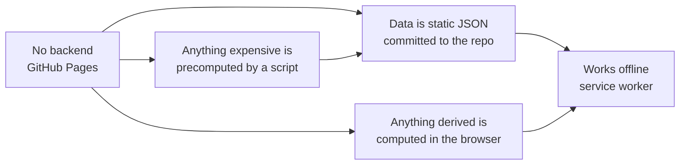
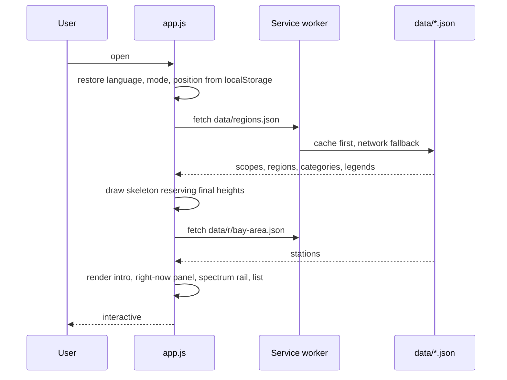
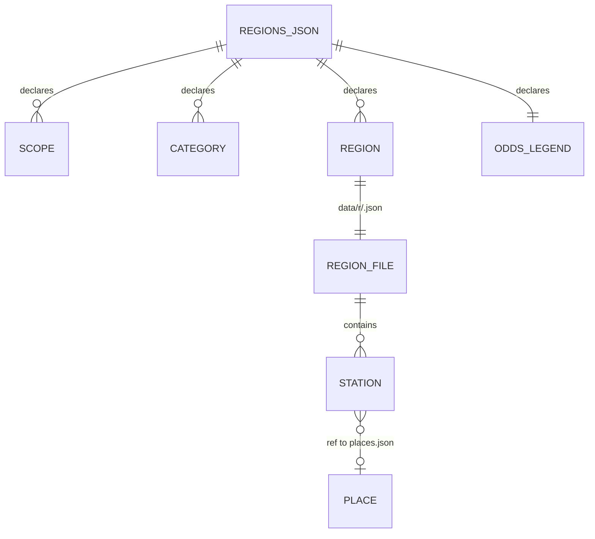
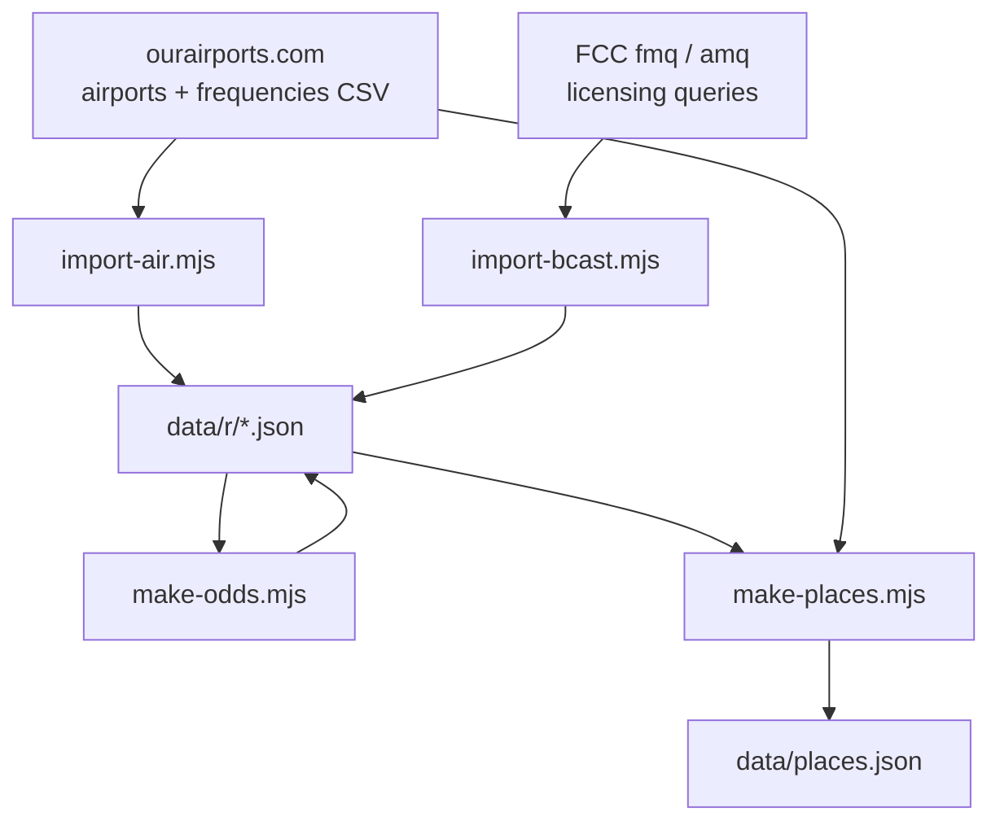
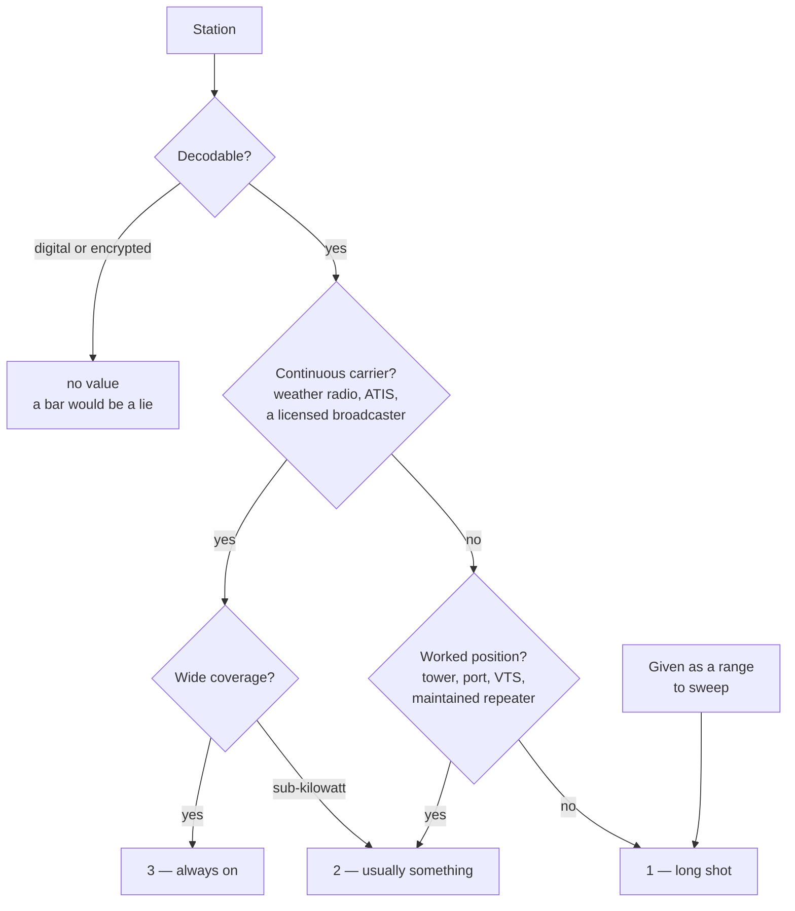
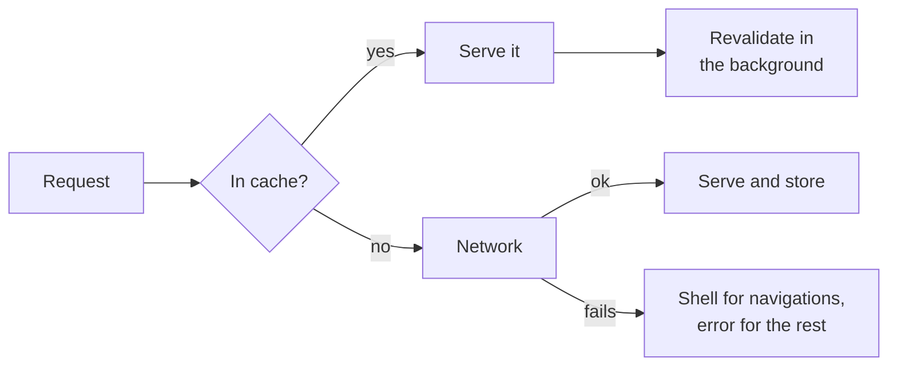

# Architecture

This describes the shape of the project rather than its details. Anything written here should
still be true after a redesign of the interface or a rewrite of the rendering; the specifics
of any one function belong in the code, where they cannot drift out of date.

## The one constraint that explains everything

The site is hosted on GitHub Pages. There is **no backend, no build step, and no database**.
Every decision below follows from that.

If a feature needs a server, it cannot exist. If it needs a lookup table, the table is
generated ahead of time by a script and committed. If it needs arithmetic — distances,
sunrise, antenna lengths, wavelengths, repeater inputs — the browser does it, which means it
keeps working in airplane mode.

## Runtime layout

Five files do the work. There is no framework, no bundler and no runtime dependency.

| File | Responsibility |
| --- | --- |
| `index.html` | The shell: header, search, region strip, and the empty containers the app fills. |
| `assets/app.js` | All behaviour, in one IIFE. Routing, rendering, state, i18n, audio, live data. |
| `assets/styles.css` | All styling, hand written, with the design tokens at the top. |
| `sw.js` | Cache-first service worker. `V` is the cache version and must be bumped on release. |
| `data/*.json` | The content. See [Data model](#data-model). |

### How a page gets drawn

The skeleton matters more than it looks. It reserves the height the real content will occupy,
including the right-now cards, so nothing moves once the data lands. Cumulative layout shift
is asserted at zero by the test suite, and the reason is physical: people use this outdoors,
one handed, and a list that jumps as you reach for it is worse than a slow one.

## Data model

`data/regions.json` is the index: which countries exist, which regions belong to them, the
category list, and the legends for odds and confidence. Each region has its own file under
`data/r/`, holding an intro and a flat array of stations. `data/places.json` is a generated
lookup from ICAO code to coordinates, so an entry can say where its transmitter is without
carrying a copy of the airport database.

A station is deliberately flat — no nesting, no references except `ref`. It is edited by hand
far more often than it is read by a program, and a shape you can scan in a text editor is
worth more than a normalised one.

### Provenance

Entries come from three places, and an entry knows which.

| `src` | Origin | Written by |
| --- | --- | --- |
| absent | Hand written, usually with prose | A person |
| `oa` | ourairports airport frequency database | `scripts/import-air.mjs` |
| `fcc` | FCC FM and AM licensing queries | `scripts/import-bcast.mjs` |

This field is what makes the importers safe to re-run. Each one strips the lines carrying its
own marker before regenerating, so it is idempotent and a rule change replaces its output
instead of stacking a second copy on top. It also means a hand-written entry can never be
destroyed by a generator, which is the failure that would matter.

## Build-time scripts

The order matters: importers first, then `make-odds.mjs` to score whatever is now there, then
`make-places.mjs` if any new `ref` appeared. All of them write into the repo and none of them
run in the browser.

Every generator holds to the same three rules, learned the hard way:

1. **Edit lines, do not re-serialise.** The data files are hand formatted. Round-tripping them
   through `JSON.stringify` loses the trailing zeros on frequencies and the blank lines that
   group categories, and turns a one-field change into an unreviewable diff.
2. **Refuse to write something broken.** After splicing text into JSON, parse it back and check
   the station count is what was intended. Fail loudly rather than commit a corrupt file.
3. **Be idempotent.** Find and replace your own previous output.

## Curation, and why the importers are deliberately small

Upstream has 30,000 airport frequencies and 9,000 licensed US broadcast stations. Importing
freely would bury the site: aviation alone reaches 56% of all entries at a natural setting.
So each importer is capped, and the caps are the feature.

| Rule | Why |
| --- | --- |
| A transmitter belongs to the region it is **nearest** | Ranking by significance inside a radius gave the Central Coast San Jose and San Francisco, 130 and 170 km away and already covered where they belong, while Monterey lost its slot |
| A handful of sites per region, a handful of positions per site | What you want from an unfamiliar airport is the weather loop, the tower, the ground. Not all eleven positions |
| One frequency per position per site | Beijing Capital publishes three tower frequencies by runway; that produced three identical rows |
| Broadcast quotas split public / commercial / AM | Sorting purely by power yields twelve commercial giants and no news, college or community radio |
| Never shadow an existing entry | Matched on frequency, on callsign, and on the site-and-position pair, so prose and local knowledge always win |
| Standard numbers listed once | 121.900 is ground control at half the fields in a metro area; repeating it stacks ticks on one spot of the spectrum rail |

## Odds

The one derived quantity in the data, and the only one with an opinion in it. It answers
"if I tune here, will I hear anything?" by folding three inputs into three levels.

Two properties are worth preserving through any rewrite. First, confidence is an *input* to
the odds rather than a second badge beside them, because a frequency nobody is sure of cannot
honestly be a sure thing. Second, the rules live in one script, not in the data, so they can
be explained, argued with and re-run; `oddsFix` exists for the cases where a rule is wrong
about one entry, and using it should stay rare enough to be noticeable.

## Modes

Simple and Pro are not a feature flag. They answer different questions, and a control belongs
to whichever question it serves.

| | Simple | Pro |
| --- | --- | --- |
| Tapping a row | Copies the frequency | Opens the detail panel; copy moves inside it |
| Under each entry | Nothing | Distance, bearing, amateur band — only when there is something to say |
| Odds indicator | Bars | Bars and the word |
| Spectrum rail | Tap to jump | A tuning knob: continuous sweep, detents, hiss, clicks |
| Above the list | Intro | Intro and the right-now panel |
| Network | None | Three live readings, each cached, each optional |

Pro is chosen deliberately: it is remembered, and `?pro=1` or `?pro=0` forces it so a view can
be shared. Simple remains the design centre — outdoors, one hand, bright sun, no signal.

## Offline

Cache-first, because the content changes rarely and being usable with no signal is the point.
The region file list is derived from `regions.json` at install time, so adding a region needs
no change to `sw.js` beyond bumping `V`. Live readings cache separately in `localStorage` with
their own expiry, and show their last known value labelled as stale rather than vanishing.

The cost of cache-first is that clients keep the old version until `V` changes. **Bumping `V`
is part of releasing**, not an optimisation.

## Tests

`.probe/suite.mjs` drives a real browser through Playwright. It is grouped, and a group name
on the command line runs only that group.

The suite deliberately asserts *behaviour and physics* rather than markup, because markup is
what changes in a redesign:

| Group | What it holds the code to |
| --- | --- |
| `regions` | Every region in both modes renders, with no blank frequencies or empty headings |
| `detail` | The panel tells the truth per service — no airband channel steps on a medium-wave station |
| `odds` | A continuous loop reads three bars, a calling channel reads one, undecodable reads none |
| `hiss` | The tuning hiss is audible across a whole sweep, and detents leave air between them |
| `wheel` | Sweeping tunes continuously, does not select text, does not scroll the page |
| `now` | The live panel works online, falls back offline, and is honest about which |
| `geo` | Distances appear only where a real transmitter site is known |
| `perf` | Layout shift is zero and first paint stays fast as the dataset grows |
| `layout` | The header survives a 280 px screen in both languages |

Two of these exist because of bugs that measurement found and inspection did not: the hiss was
26 dB down and silenced across the busiest part of the band, and the right-now cards sized
themselves to their text and shoved the spectrum rail down the page after load. Both looked
fine in a screenshot. When changing anything about the knob or the panel, measure it.

## What is not here, on purpose

- **No framework.** The whole interface is a list, a rail and a header. A framework would
  be more code than the application.
- **No bundler.** One script tag. The payload is 100 KB of code.
- **No map tiles.** A third-party tile server is a network dependency and a privacy leak on a
  site whose selling point is neither.
- **No analytics.** Nothing is sent anywhere except the three live readings, one of which
  carries a deliberately rounded position.
